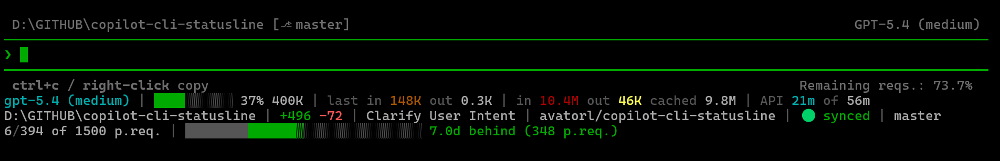

# Copilot CLI Status Line

A customizable status line for [GitHub Copilot CLI](https://docs.github.com/en/copilot/github-copilot-in-the-cli) that keeps the important session details visible right in your terminal: model, context usage, token spend, session duration, premium requests, quota pace, current folder, session name, and lines changed.


## What It Shows

The script can render **up to three configurable lines**. By default, it uses the first two and leaves the third line empty, so nothing extra is printed.

The first line is the "how is this session going?" line: it shows the active model, how full the context window is, how many input/output tokens have been spent, how long the session has been running, how many premium requests this session has used, and whether your monthly premium quota is currently running **behind pace** (good), **on pace**, or **ahead of budget** (bad).

The second line is the "where am I and what changed?" line: it shows the current working directory, the Copilot session name, and the session's cumulative added/removed lines so you can keep your bearings while you work.

The third line is available for any extra segments you want, but it is **disabled by default**.

The default layout is:

```text
gpt-5.4 (high) | [bar chart] 22% 400K | in 1.7M out 27K cached 350K | 54m | 5 p.req. | [chart - quota pace tracker] 3.2d behind (160 p.req.)
D:\GITHUB\my-project | Fix quota bar math | +695 -146
```



### Line 1 - Session Overview

| Segment | What it tells you | Source field(s) | Notes |
|---------|-------------------|-----------------|-------|
| **Model** | Which model is answering right now | `model.display_name`, fallback `model.id` | Uses the terminal's default text color |
| **Context usage** | How full the current context window is | `context_window.used_percentage`, `context_window.context_window_size` | Renders a 10-cell bar, rounded percent, and compact size |
| **Tokens** | How many input, output, and cached tokens the session has spent so far | `context_window.total_input_tokens`, `context_window.total_output_tokens`, `context_window.total_cache_read_tokens`, `context_window.total_cache_write_tokens` | Shows `in`, `out`, and `cached` totals; `cached` = read + write |
| **Duration** | How long the session has been running | `cost.total_duration_ms` | Rounded to whole minutes; hidden under 30 seconds |
| **Premium requests** | How many premium requests this session has used | `cost.total_premium_requests` | Rendered as `N p.req.` |
| **Quota** | Whether monthly premium usage is behind pace, on pace, ahead, or exceeded | GitHub Copilot quota API: `quota_snapshots.premium_interactions.percent_remaining`, `quota_snapshots.premium_interactions.entitlement` | Uses a month-shaped calendar bar |

### Line 2 - Workspace Overview

| Segment | What it tells you | Source field(s) | Notes |
|---------|-------------------|-----------------|-------|
| **Path** | Which folder Copilot currently considers the working directory | `cwd`, fallback `workspace.current_dir` | Uses `Get-Location` if neither is present |
| **Session name** | The current Copilot session's human-readable name | `session_name` | Rendered exactly as provided by Copilot |
| **Lines changed** | How many lines were added and removed during this session | `cost.total_lines_added`, `cost.total_lines_removed` | Shows green `+N` and bright red `-N` |

### Line 3 - Optional Extra Line

| Segment | What it tells you | Source field(s) | Notes |
|---------|-------------------|-----------------|-------|
| **Any supported segment** | Anything you want to move off the first two lines | Same as the segment you place there | Empty by default, so no third line is printed |

## Customizing the Layout

At the top of `statusline.ps1`, edit these arrays to choose which segments are shown and in what order:

```powershell
$Line1Layout = @(
    'model'
    'context_bar'
    'tokens'
    'duration'
    'premium_requests'
    'quota'
)

$Line2Layout = @(
    'path'
    'session_name'
    'lines_changed'
)

$Line3Layout = @(
)
```

Remove a segment name to hide it, reorder entries to change display order, or move segments between lines. Leave `$Line3Layout` empty to suppress the third line entirely.

Available segment names:

| Segment name | Default line | What it shows | Source field(s) |
|--------------|--------------|---------------|-----------------|
| `model` | 1 | Active model name | `model.display_name`, fallback `model.id` |
| `context_bar` | 1 | Context-window usage bar, rounded percent, and size | `context_window.used_percentage`, `context_window.context_window_size` |
| `tokens` | 1 | Cumulative input, output, and cached token totals | `context_window.total_input_tokens`, `context_window.total_output_tokens`, `context_window.total_cache_read_tokens` + `total_cache_write_tokens` |
| `duration` | 1 | Session wall-clock time | `cost.total_duration_ms` |
| `premium_requests` | 1 | Premium request count | `cost.total_premium_requests` |
| `quota` | 1 | Monthly premium quota pacing indicator | Copilot quota API `percent_remaining`, `entitlement` |
| `path` | 2 | Current workspace / working directory | `cwd`, fallback `workspace.current_dir` |
| `session_name` | 2 | Human-readable Copilot session name | `session_name` |
| `lines_changed` | 2 | Added and removed lines from the session payload | `cost.total_lines_added`, `cost.total_lines_removed` |

If `quota` is removed from all layout arrays, the script skips the GitHub quota API call entirely.

## Quota Calendar

The quota segment renders the current month as a compact calendar. The label is intentionally inverted from typical schedule language:

- **behind** = under quota pace (good)
- **on pace** = close to target
- **ahead** = over quota pace (bad)

<table>
  <tr>
    <th>Legend</th>
    <th>Meaning</th>
  </tr>
  <tr>
    <td><code>█</code></td>
    <td>Past day outside the pace deviation</td>
  </tr>
  <tr>
    <td><code>█</code> in green</td>
    <td>Behind-pace spillover into previous days</td>
  </tr>
  <tr>
    <td><code>▓</code></td>
    <td>Today</td>
  </tr>
  <tr>
    <td><code>░</code> in red</td>
    <td>Ahead-of-pace spillover into future days</td>
  </tr>
  <tr>
    <td><code>░</code></td>
    <td>Future day outside the pace deviation</td>
  </tr>
  <tr>
    <td><code>🔴 quota exceeded</code></td>
    <td>Usage reached or passed 100%</td>
  </tr>
</table>

Today is **white only when on pace**. When usage is behind or ahead, the today bar switches to the matching pace color and stays rendered as a dark shade `▓`. The green or red overlay appears only when the time-of-day-aware deviation rounds to at least **0.5 day** of spillover beyond today.

When the Copilot quota API returns `entitlement`, the pace label also includes a premium request estimate such as `(160 p.req.)`. For **behind**, that number represents requests still available relative to calendar pace; for **ahead**, it represents how many premium requests are already over pace.

If the quota API is unavailable, the script falls back to a dim `day/month` indicator after the quota calendar.

## Color Rules

<table>
  <tr>
    <th>Area</th>
    <th>Rule</th>
    <th>Example</th>
  </tr>
  <tr>
    <td>Context bar</td>
    <td>🟢 under 75%, 🟡 at 75%+, 🔴 at 90%+</td>
    <td><code>██████░░░░ 60%</code>, <code>████████░░ 80%</code>, <code>█████████░ 92%</code></td>
  </tr>
  <tr>
    <td>Unused context cells</td>
    <td>Dim grey</td>
    <td><code>██████░░░░</code></td>
  </tr>
  <tr>
    <td>Token values</td>
    <td>🟡 bright yellow at 10K+, 🟠 yellow at 100K+, 🔴 bright red at 1M+, dark red at 10M+</td>
    <td><code>in 27K</code>, <code>in 174K</code>, <code>in 1.7M</code></td>
  </tr>
  <tr>
    <td>Quota pace</td>
    <td>🟢 behind, ⚪ on pace, 🔴 ahead</td>
    <td><code>2.4d behind</code>, <code>on pace</code>, <code>1.1d ahead</code></td>
  </tr>
  <tr>
    <td>Lines changed</td>
    <td>Added lines are green; removed lines are bright red</td>
    <td><code>+695 -146</code></td>
  </tr>
</table>

## Requirements

- **Windows**
- **[PowerShell 7+](https://github.com/PowerShell/PowerShell/releases)** (`pwsh.exe`)
- **GitHub Copilot CLI** with the `STATUS_LINE` experimental flag enabled
- A terminal with ANSI color and Unicode block character support (Windows Terminal works well)

## Installation

### 1. Clone or copy the files

```bash
git clone https://github.com/avatorl/copilot-cli-statusline.git
```

Example destination:

```text
C:\Users\<you>\.copilot\statusline\
├── statusline.ps1
└── statusline.cmd
```

### 2. Verify `statusline.cmd`

The wrapper locates `statusline.ps1` from its own directory using `%~dp0`. If PowerShell 7 is installed in a different location, update the `pwsh.exe` path:

```cmd
@echo off
"C:\Program Files\PowerShell\7\pwsh.exe" -NoProfile -File "%~dp0statusline.ps1"
```

### 3. Configure Copilot CLI

Edit `~/.copilot/config.json`:

```jsonc
{
  "experimental": true,
  "experimental_flags": ["STATUS_LINE"],
  "statusLine": {
    "type": "command",
    "command": "C:\\Users\\<you>\\.copilot\\statusline\\statusline.cmd"
  }
}
```

Use an absolute path and escape backslashes in JSON.

### 4. Restart Copilot CLI

Start a new Copilot CLI session and the status line should appear automatically.

## Local Testing

There is no automated test suite. Test by piping sample payloads into `statusline.ps1`.

```powershell
# Full payload (with cache tokens and session name)
'{"cwd":"D:\\TEST","session_name":"Fix quota bar math","model":{"id":"gpt-5.4","display_name":"gpt-5.4 (high)"},"workspace":{"current_dir":"D:\\TEST"},"cost":{"total_duration_ms":3241747,"total_lines_added":100,"total_lines_removed":50,"total_premium_requests":5},"context_window":{"total_input_tokens":1744196,"total_output_tokens":26870,"total_cache_read_tokens":85000,"total_cache_write_tokens":12000,"context_window_size":400000,"used_percentage":22}}' | pwsh -NoProfile -File .\statusline.ps1

# Minimal payload
'{"context_window":{"context_window_size":400000,"used_percentage":0}}' | pwsh -NoProfile -File .\statusline.ps1

# Empty stdin
echo $null | pwsh -NoProfile -File .\statusline.ps1
```

## How It Works

1. Copilot CLI pipes a JSON payload to stdin on each refresh.
2. `statusline.ps1` parses the payload and extracts the configured segment values.
3. The script optionally fetches quota data from `https://api.github.com/copilot_internal/user`.
4. Quota usage is compared against calendar progress for the current month using time-of-day-aware rounding and spillover-based bar rendering.
5. The configured line layouts are resolved into segment strings and written to stdout.

## GitHub Token Resolution

The quota API call runs outside Copilot CLI itself, so the script needs its own way to find a token. Multiple lookup paths are useful because different setups authenticate in different ways.

The script currently checks for a token in this order:

1. `COPILOT_GITHUB_TOKEN`
2. `GH_TOKEN`
3. `GITHUB_TOKEN`
4. `~/.copilot/config.json` → `copilot_tokens`
5. `gh auth token`

Notes:

- `COPILOT_GITHUB_TOKEN`, `GH_TOKEN`, and `GITHUB_TOKEN` are all valid Copilot CLI auth sources for non-interactive setups when the token has the required **Copilot Requests** permission.
- `~/.copilot/config.json` is only relevant when Copilot CLI stored credentials in plaintext because the system keychain was unavailable.
- `gh auth token` is a better fallback than `git credential fill` for this script because Copilot CLI officially supports GitHub CLI auth fallback, while generic Git credentials may not match the token Copilot uses.
- The script does **not** read the Windows Credential Manager directly. If your Copilot login lives only there, use an environment variable or sign in with `gh` if you want quota lookups to work from the script.

## Debug Logging

`statusline.ps1` has a top-level `$DebugLog` switch. It is currently **off by default**:

```powershell
$DebugLog = $false
```

When enabled, raw stdin payloads are appended to `statusline.stdin.log` next to the script.

## Payload Parameters

The Copilot CLI pipes a JSON object to stdin on each refresh. Two payload shapes are common:

- **Minimal payload**: usually just `context_window` when a session starts
- **Full payload**: includes model, workspace, cost, and context fields

### Top-level fields

| Field | Type | Used now | Meaning |
|-------|------|----------|---------|
| `cwd` | `string` | Yes | Current working directory |
| `session_id` | `string` | No | Unique session identifier |
| `session_name` | `string` | Yes | Human-readable session name |
| `transcript_path` | `string` | No | Path to the session transcript folder |
| `version` | `string` | No | Copilot CLI version |

### `model`

| Field | Type | Used now | Meaning |
|-------|------|----------|---------|
| `model.id` | `string` | Yes | Model identifier such as `gpt-5.4` |
| `model.display_name` | `string` | Yes | Friendly display name |

### `workspace`

| Field | Type | Used now | Meaning |
|-------|------|----------|---------|
| `workspace.current_dir` | `string` | Yes | Workspace root directory |

### `cost`

| Field | Type | Used now | Meaning |
|-------|------|----------|---------|
| `cost.total_api_duration_ms` | `int` | No | Cumulative API call time in milliseconds |
| `cost.total_lines_added` | `int` | Yes | Total lines added in this session |
| `cost.total_lines_removed` | `int` | Yes | Total lines removed in this session |
| `cost.total_duration_ms` | `int` | Yes | Total session wall-clock time in milliseconds |
| `cost.total_premium_requests` | `int` | Yes | Premium request count for this session |

### `context_window`

| Field | Type | Used now | Meaning |
|-------|------|----------|---------|
| `context_window.total_input_tokens` | `int` | Yes | Cumulative input tokens |
| `context_window.total_output_tokens` | `int` | Yes | Cumulative output tokens |
| `context_window.total_cache_read_tokens` | `int` | Yes | Tokens served from cache |
| `context_window.total_cache_write_tokens` | `int` | Yes | Tokens written to cache |
| `context_window.total_tokens` | `int` | No | Sum of input and output tokens |
| `context_window.context_window_size` | `int` | Yes | Max context window size |
| `context_window.used_percentage` | `int` | Yes | Percent of context window used |
| `context_window.remaining_percentage` | `int` | No | Percent of context window free |
| `context_window.remaining_tokens` | `int` | No | Tokens still available |
| `context_window.last_call_input_tokens` | `int` | No | Input tokens in the last call |
| `context_window.last_call_output_tokens` | `int` | No | Output tokens in the last call |

### `context_window.current_usage`

| Field | Type | Used now | Meaning |
|-------|------|----------|---------|
| `context_window.current_usage.input_tokens` | `int` | No | Raw input tokens used |
| `context_window.current_usage.output_tokens` | `int` | No | Raw output tokens used |
| `context_window.current_usage.cache_creation_input_tokens` | `int` | No | Cache creation tokens |
| `context_window.current_usage.cache_read_input_tokens` | `int` | No | Cache read tokens |

### External API used by the script

| Source | Used now | Meaning |
|--------|----------|---------|
| GitHub Copilot quota API `quota_snapshots.premium_interactions.percent_remaining` | Yes | Remaining premium quota percentage |
| GitHub Copilot quota API `quota_snapshots.premium_interactions.entitlement` | Yes | Monthly premium request budget used to estimate pace hints |

## License

[MIT](LICENSE)
